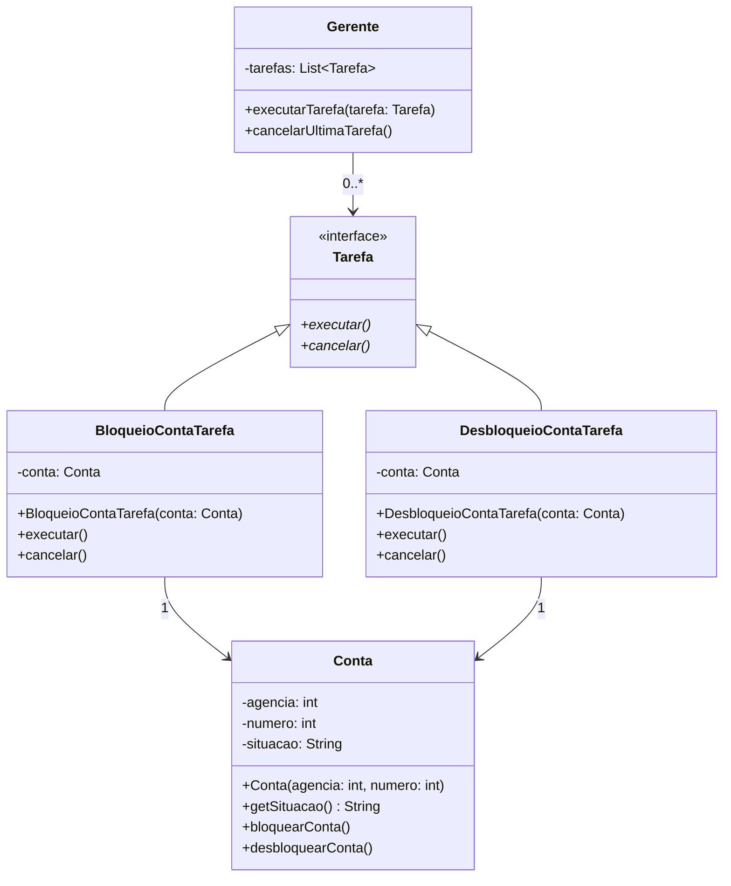

# Diagrama UML — Command (Bloqueio de Conta)

```mermaid
classDiagram
    class Gerente {
        -tarefas: List~Tarefa~
        +executarTarefa(tarefa: Tarefa)
        +cancelarUltimaTarefa()
    }

    class Tarefa {
        <<interface>>
        +executar()*
        +cancelar()*
    }

    class BloqueioContaTarefa {
        -conta: Conta
        +BloqueioContaTarefa(conta: Conta)
        +executar()
        +cancelar()
    }

    class DesbloqueioContaTarefa {
        -conta: Conta
        +DesbloqueioContaTarefa(conta: Conta)
        +executar()
        +cancelar()
    }

    class Conta {
        -agencia: int
        -numero: int
        -situacao: String
        +Conta(agencia: int, numero: int)
        +getSituacao() String
        +bloquearConta()
        +desbloquearConta()
    }

    Gerente --> Tarefa : 0..*
    Tarefa <|-- BloqueioContaTarefa
    Tarefa <|-- DesbloqueioContaTarefa
    BloqueioContaTarefa --> Conta : 1
    DesbloqueioContaTarefa --> Conta : 1
```
